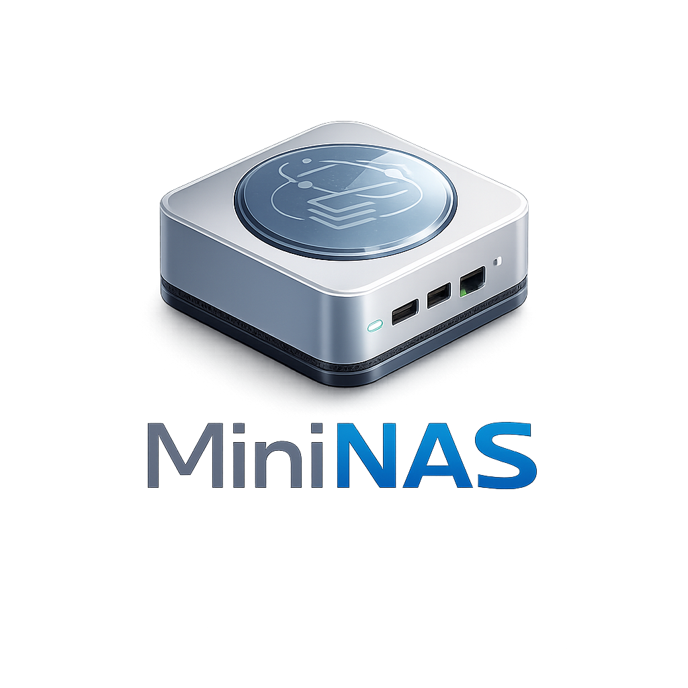

<p align="center">
  
</p>

<p align="center">
  Turn any Mac into a personal cloud storage server.<br>
  Browse, upload, preview, and share files from any device — no subscriptions, no third parties.
</p>

<p align="center">
  <a href="#quick-start">Quick Start</a> &bull;
  <a href="#features">Features</a> &bull;
  <a href="#configuration">Configuration</a> &bull;
  <a href="#access-from-anywhere">Remote Access</a> &bull;
  <a href="#development">Development</a>
</p>

---

## Why MiniNAS?

You already own the hardware. A Mac Mini with a couple of USB SSDs is more storage than most cloud plans offer — and it's yours. MiniNAS gives you a clean web interface to manage it all, accessible from your phone, tablet, or any browser.

- **No monthly fees.** Your data lives on your drives, not someone else's servers.
- **No file size limits.** Upload anything — resumable uploads handle multi-gigabyte files without breaking a sweat.
- **No apps to install.** It's a web app. Works on macOS, iOS, Android, Windows — any device with a browser.
- **No passwords to remember.** Sign in with Touch ID, Face ID, or your device's biometrics via Passkeys.

## Features

**File Management**
- Browse files across multiple USB drives from a single interface
- List and grid views with file-type icons
- Create folders, rename, move, and delete
- Breadcrumb navigation with full path history

**Uploads**
- Drag-and-drop files or entire folders
- Resumable uploads — pause, resume, or recover from network interruptions
- Per-file progress tracking with cancel support
- No file size limits

**Preview & Search**
- Inline preview for images, video, audio, PDFs, and text files
- Auto-generated thumbnails for images and video
- Search files by name across all your drives instantly

**Sharing**
- Generate share links for any file
- Optional password protection
- Set expiration times and download limits
- Share links work without requiring the recipient to log in

**Security**
- Passkey authentication (WebAuthn) — no passwords, just biometrics
- All API routes are session-protected
- Path traversal prevention on every file operation
- Rate limiting on authentication endpoints

**Works Everywhere**
- Installable as a PWA on iOS and Android home screens
- Designed for mobile and desktop
- Dark interface that looks great on any screen size

## Quick Start

### Prerequisites

- **Node.js** 20+ and **pnpm**
- **ffmpeg** (optional, for video thumbnails): `brew install ffmpeg`

### Install

```bash
git clone https://github.com/theAlexPatin/MiniNAS.git
cd MiniNAS
pnpm install
```

### Configure

Copy the example config and edit it:

```bash
cp .env.example .env
```

The most important setting is `VOLUMES` — tell MiniNAS where your drives are mounted:

```env
# Format: id:label:path — comma-separated for multiple drives
VOLUMES=ssd1:SSD 1:/Volumes/SSD1,ssd2:SSD 2:/Volumes/SSD2

# Generate a session secret
SESSION_SECRET=$(openssl rand -hex 32)
```

### Run

```bash
pnpm dev
```

This starts both the API server (port 3001) and the web frontend (port 4321). Open **http://localhost:4321** in your browser.

On first visit, you'll be prompted to register a Passkey — this is your login credential going forward. No username or password needed.

## Configuration

| Variable | Default | Description |
|----------|---------|-------------|
| `VOLUMES` | — | Comma-separated list of `id:label:path` entries |
| `PORT` | `3001` | API server port |
| `SESSION_SECRET` | — | Secret for signing session tokens (generate with `openssl rand -hex 32`) |
| `RP_ID` | `localhost` | WebAuthn Relying Party ID (your domain or `localhost`) |
| `RP_ORIGIN` | `http://localhost:4321` | Frontend URL for WebAuthn verification |
| `DB_PATH` | `./data/mininas.db` | SQLite database location |
| `THUMBNAIL_DIR` | `./.mininas/thumbnails` | Where generated thumbnails are cached |
| `UPLOAD_STAGING_DIR` | `./.mininas/uploads` | Temporary directory for in-progress uploads |

## Access from Anywhere

MiniNAS is designed to pair with [Tailscale](https://tailscale.com) for secure remote access. Install Tailscale on your Mac Mini and your devices, then:

1. Set `RP_ID` to your Tailscale hostname (e.g., `mac-mini.tailnet.ts.net`)
2. Set `RP_ORIGIN` to `https://mac-mini.tailnet.ts.net:4321`
3. Enable [Tailscale HTTPS](https://tailscale.com/kb/1153/enabling-https) for valid certificates

Your NAS is now securely accessible from anywhere in the world — no port forwarding, no dynamic DNS, no exposed services.

## Tech Stack

| Layer | Technology |
|-------|-----------|
| API | [Hono](https://hono.dev) + Node.js |
| Database | SQLite via [better-sqlite3](https://github.com/WiseLibs/better-sqlite3) |
| Auth | [WebAuthn/Passkeys](https://simplewebauthn.dev) + JWT sessions |
| Uploads | [tus protocol](https://tus.io) for resumable uploads |
| Thumbnails | [sharp](https://sharp.pixelplumbing.com) (images) + ffmpeg (video) |
| Frontend | [Astro](https://astro.build) + React + [Tailwind CSS](https://tailwindcss.com) |
| Data Fetching | [TanStack Query](https://tanstack.com/query) |

---

## Development

MiniNAS is a pnpm monorepo managed with [Turborepo](https://turbo.build).

```
packages/
  api/     # Hono REST API server
  web/     # Astro + React frontend
```

### Commands

```bash
pnpm dev          # Start both API and frontend in dev mode
pnpm build        # Build everything for production

# Run packages individually
pnpm --filter @mininas/api dev
pnpm --filter @mininas/web dev
```

### API Structure

```
packages/api/src/
  routes/        # Hono route handlers (files, download, upload, auth, search, share, preview, volumes)
  services/      # Business logic (filesystem, sessions, indexer, thumbnails, share)
  middleware/    # Auth verification, CORS, rate limiting
  db/            # SQLite connection + schema
  types/         # Zod schemas for request/response validation
```

### Adding a Volume

Volumes are configured via the `VOLUMES` environment variable. Each entry is `id:label:mountPath`:

```env
VOLUMES=photos:Photos:/Volumes/PhotosSSD,backup:Backups:/Volumes/BackupDrive
```

The API auto-detects disk space for each volume and the file indexer watches for changes in real time.

---

<p align="center">
  Built for personal use. No telemetry, no analytics, no cloud dependencies.<br>
  Your files, your hardware, your rules.
</p>
